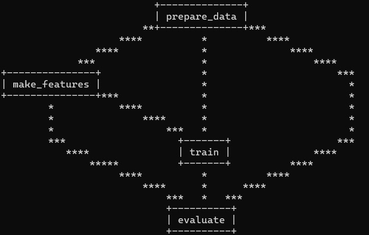

# Sentiment Analysis with DVC Pipeline

## Overview

This project builds an end-to-end **sentiment classification pipeline** on the IMDB movie review dataset using **DVC**. The goal is to classify reviews as **positive** or **negative** while ensuring a **reproducible ML workflow**.

---

## Pipeline

The pipeline automates the full ML lifecycle:

```text
prepare_data → make_features → train → evaluate
```



* **prepare_data**: Load and split the IMDB dataset to train and test sets.
* **make_features**: Convert text to features
* **train**: Train classification model
* **evaluate**: Compute performance metrics

---

## 📂 Structure

```text

├── .dvc/                  
├── archive/              # Data and model artifacts
│   ├── imdb-dataset.csv
│   ├── train.csv
│   ├── test.csv
│   ├── train.joblib
│   ├── test.joblib
│   ├── model.joblib
│   └── results.yaml
├── images/
│   └── pipeline.png      # DVC pipeline visualization
├── prepare_data.py       # Data preprocessing
├── make_features.py      # Feature engineering
├── train.py              # Model training
├── evaluate.py           # Model evaluation
├── dvc.yaml              # DVC pipeline definition
├── dvc.lock              
├── params.yaml           # ML parameters
├── requirements.txt
├── README.md
├── LICENSE
```

## ⚙️ Setup

```bash
git clone git@github-main:YOUR_USERNAME/sentiment-analysis-ml-dvc-pipeline.git
cd sentiment-analysis-ml-dvc-pipeline
pip install -r requirements.txt
```

---

## 🚀 Run

```bash
dvc dag
dvc repro
```